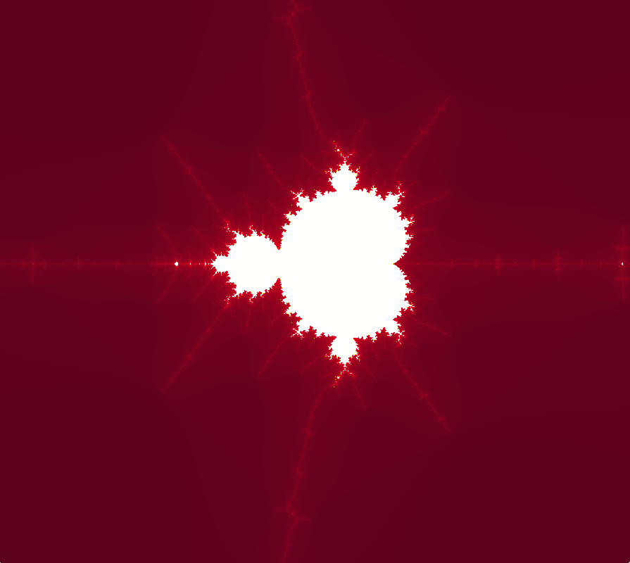
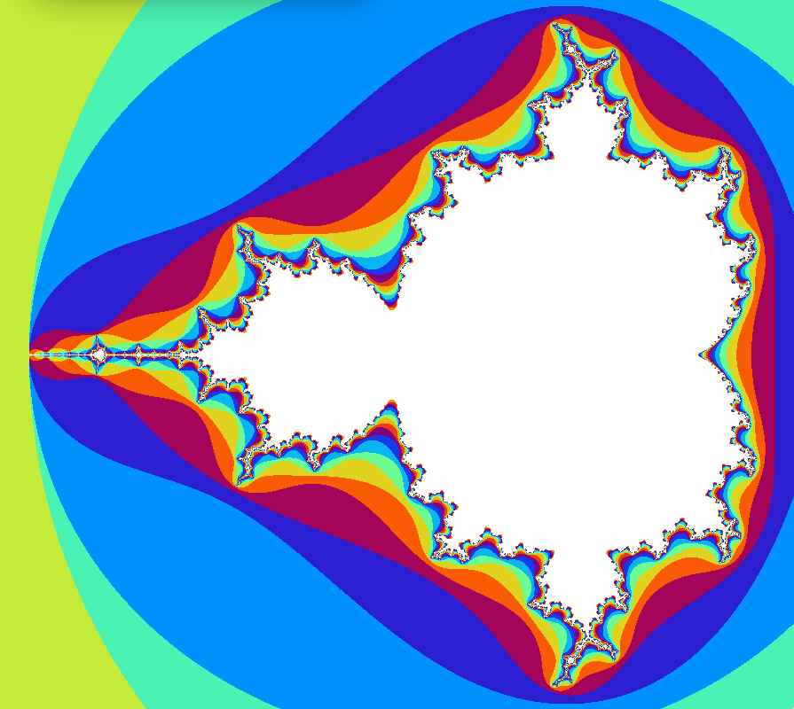
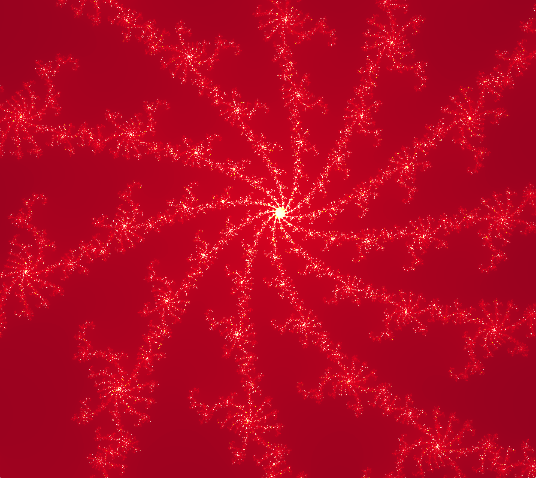
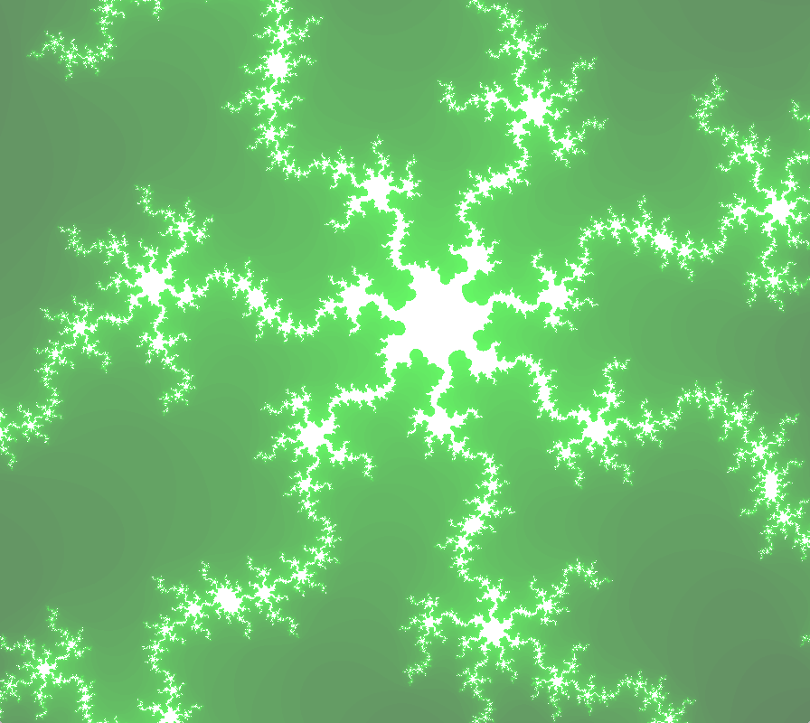
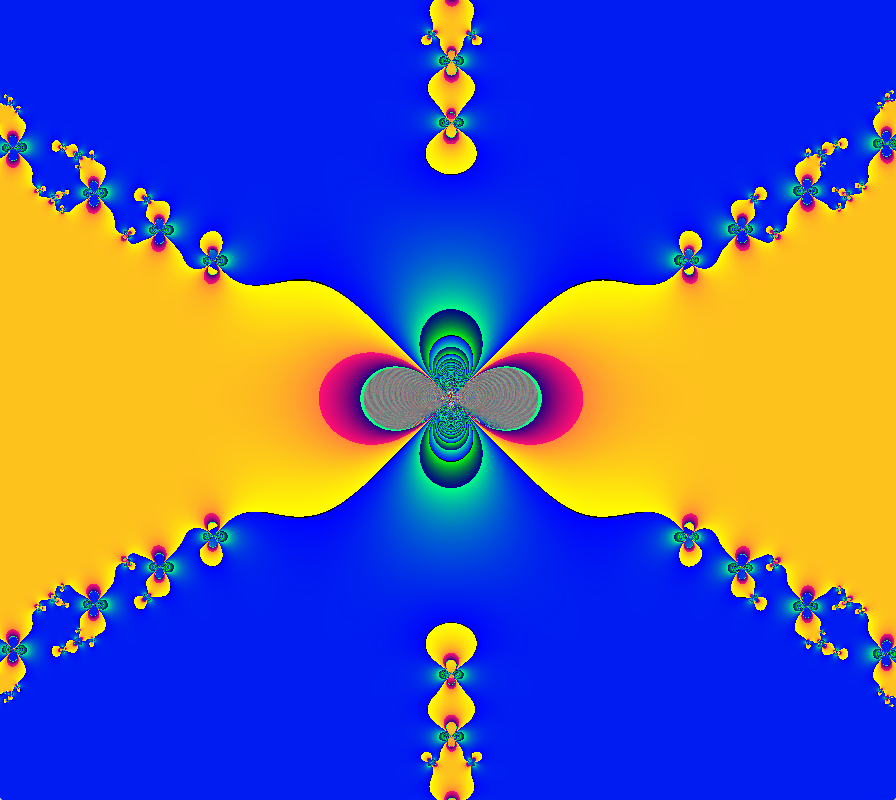
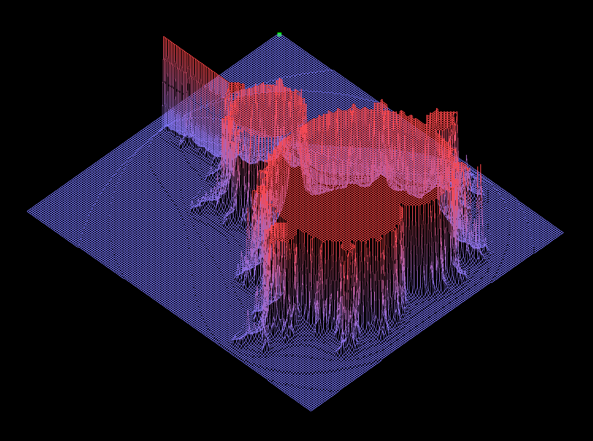

# 42-fractol
#### 2D fractal engine with OpenCL hardware acceleration

The project was about drawing fractals using a graphics library, in C.

Some students focused on making beautiful fractals, other focused on mathematics, and I focused on making the zoom very fast, powerful and psychedelic using parallel computing.

The binary can be compiled with or without OpenCL and thus can still run in CPU mode.

Requires minilibx - see mlx folder

And with a 3D representation of Mandelbrot's fractal :

You can see the middle part tends to infinity and that the iterations are arbitrarily stopped.
